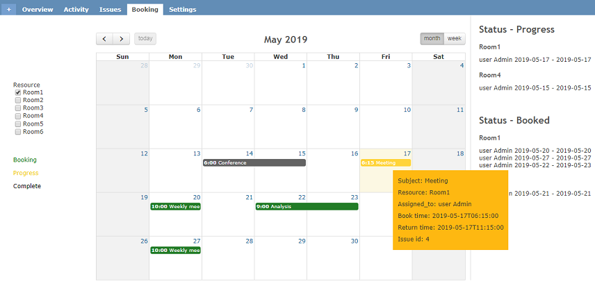
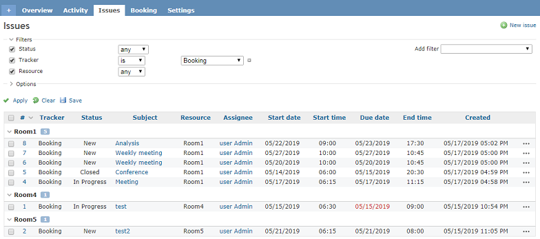

# redmine_resource_booking_system
Provides a resource booking system with javascript fullcalendar.
This plugin uses issue and specified tracker, so customization can be done in the redmine original function.

  
## Main features
* Display a booking calendar
* Booking process can be completed on the calendar view
* Resource ledger (use default 'issue' index tab)

# Screenshots
#### Overview

#### Plugin Setting

# Installation notes

## Install

1. go to plugins folder
<pre>
git clone https://github.com/aki360P/redmine_resource_booking_system.git
</pre>
2. bundle install or change source code
<pre>
bundle install
</pre>
3. migration
<pre>
rake redmine:plugins:migrate NAME=redmine_resource_booking_system RAILS_ENV=production
</pre>
4. restart server
5. Configuration (Redmine)
   Authentication required
   Enable REST web service
6. Configuration (Plugin)
 Go to the project setting tab and complete plugin settings
 
**!NOTICE!**
It is important to use the ISO format for the start and end time custom fields (so 13:00 instead of 1:00pm, And 08:00 instead of 8:00)!
Resource must be defiend with 'key-value-list' customfield!
 
### How to skip bundle install(change source code)

* delete Gemfile
* change source code *.rb in ./plugins/redmine_resource_booking_system/db/migrate.
 First line needs to be changed according to your rails version
<pre>
 class CreateTable < ActiveRecord::CompatibleLegacyMigration.migration_class
  #for redmine 3x,  class CreateTable < ActiveRecord::Migration
  #for redmine 4x,  class CreateTable < ActiveRecord::Migration[4.2]
</pre>

## UnInstall

<pre>
rake redmine:plugins:migrate NAME=redmine_resource_booking_system VERSION=0 RAILS_ENV=production
</pre>

# How it Works

* The plug-in uses a Fullcalendar plug-in which uses ajax calls to fetch the events.  
* The calendar has a toggleable Month view and Week view on the top right corner.
* The resources are booked with the currently logged in users authorship but can be assigned to another user.
* This plug-in uses Rest-api to view issues with specific tracker in current project.
* This plug-in uses cookie to remember current calendar date, only when 'prev' clicked rest-api function is called.

